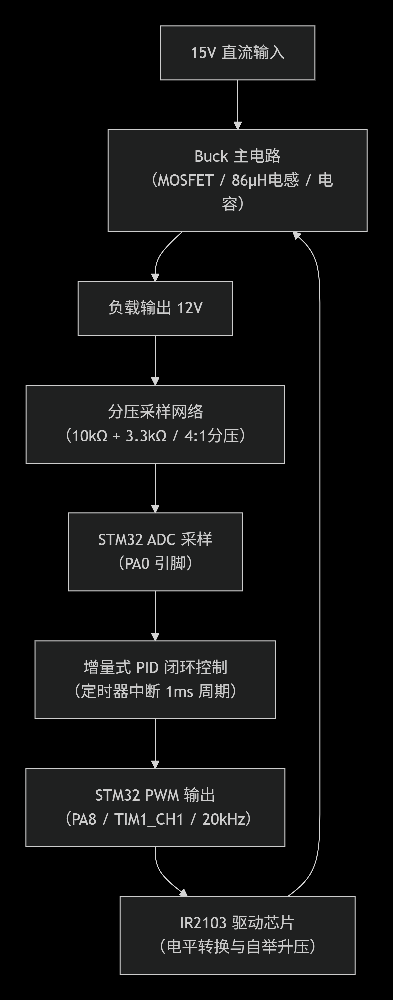
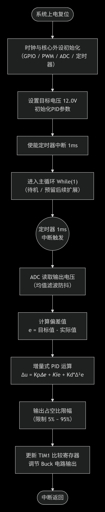
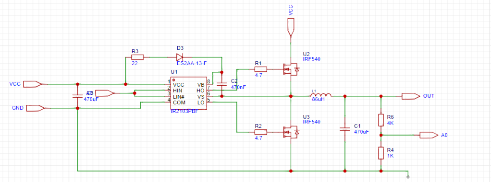

# project-stm32-buck
## —— 基于STM32的Buck电路的设计
## 简介
该仓库用来存储小组中嵌入式项目——基于STM32的Buck电路的设计，所需要的代码与文档。

---

# 一、项目计划书 
时间：2026-06-30 9:00  
项目计划书介绍了小组的工作计划，时间安排，物料采购计划与分工方案  
•	工作计划：从选题到验收的详细时间节点，明确各阶段里程碑  
•	时间安排：组内成员的可投入时间与分工协调计划  
•	物料采购计划：列出所需全部物料清单（型号、数量、单价、采购渠道），预估总成本  
•	分工方案：明确每位成员的具体职责（硬件设计、软件开发、测试调试、文档撰写等）  

---

## 1 工作计划

### 1.1 总体时间规划

| 阶段     | 时间节点          | 主要任务                 | 简介                                                         |
| -------- | ----------------- | ------------------------ | ------------------------------------------------------------ |
| 第一阶段 | 2026.06.29        | 选题与方案论证           | 确定技术方案，完成器件选型                                   |
| 第二阶段 | 2026.06.29-06.30  | 物料采购与原理图设计     | 完成物料下单，绘制电路原理图                                 |
| 第三阶段 | 2026.07.01-07.02  | 硬件搭建与软件框架搭建   | 完成硬件焊接与STM32基础工程建立                              |
| 第四阶段 | 2026.07.03-07.06  | 软硬件联调与中期检查     | 实现基本降压功能，完成中期检查报告                           |
| 第五阶段 | 2026.07.07-07.09  | 功能扩展与第一次验收     | 完成扩展功能，进行第一次验收演示                             |
| 第六阶段 | 2026.07.10        | 改进完善与第二次验收     | 根据反馈优化，完成最终验收                                   |

---

### 1.2 详细工作计划

**第一阶段：选题与方案论证（6月29日）**

- 理解Buck电路工作原理与拓扑结构
- 确定控制策略（电压模式PWM控制，PID闭环调节）
- 完成关键元件参数计算（电感、电容、分压电阻等）
- 制定物料清单并下单采购

**第二阶段：原理图设计与物料准备（6月29日-6月30日）**

- 绘制电路原理图（含Buck主电路、STM32控制电路、电压采样电路、IR2103驱动电路）
- 完成PCB布局规划（扩展要求3）
- 跟踪物料到货情况

**第三阶段：硬件搭建与软件框架（7月1日-7月2日）**

- 硬件：焊接搭建Buck电路，检查各模块连接
- 软件：STM32工程建立，配置PWM输出、ADC采样、定时器中断
- 编写PID控制算法框架

**第四阶段：软硬件联调（7月3日-7月6日）**

- 调试PWM输出与IR2103驱动信号
- 调试ADC电压采样电路（4:1分压）
- PID参数整定，实现15V→12V稳定降压输出
- 测试不同负载下的效率（5Ω、8Ω、10Ω、20Ω、30Ω、40Ω）
- 完成中期检查报告

**第五阶段：功能扩展（7月7日-7月9日）**

- 扩展1：旋转编码器与OLED显示调试
- 扩展2：蓝牙模块通信与上位机开发
- 扩展3/4：PCB设计或效率优化（二选一）
- 准备第一次验收演示

**第六阶段：验收与总结（7月9日-7月10日）**

- 7月9日：第一次验收，记录教师反馈
- 7月10日：改进后第二次验收

---

## 2 时间安排与分工协调

### 2.1 组内成员可投入时间

| 成员   | 每日可投入时间 | 备注           |
| ------ | -------------- | -------------- |
| 李天深 | 2-3小时        | 可全天投入     |
| 梁夏   | 2-3小时        | 嵌入式比赛     |
| 陈儒虔 | 2-3小时        | 嵌入式比赛     |

---

### 2.2 关键时间节点的工作强度安排

- **6月29日-30日**：全员集中，完成方案设计与物料采购
- **7月1日-6日**：软硬件并行开发，每日同步进度
- **7月7日-9日**：联调与扩展功能开发，适当延长工作时间
- **7月9日-10日**：验收准备与答辩演练

---

## 3 物料采购计划

### 3.1 物料清单

| 序号 | 器件名称         | 型号/参数                             | 数量 | 单价（估算） | 小计    | 采购渠道                | 用途                 |
| ---- | ---------------- | ------------------------------------- | ---- | ------------ | ------- | ----------------------- | -------------------- |
| 1    | STM32最小系统板  | STM32F103C8T6核心板                   | 1    | ¥8.50        | ¥8.50   | 淘宝/京东               | 主控芯片             |
| 2    | 驱动芯片         | IR2103（SOP-8封装）                   | 1    | ¥8.04        | ¥8.04   | 立创商城/云汉芯城       | MOSFET驱动           |
| 3    | 快恢复二极管     | ES2AA-13-F（SMA封装，2A/50V）         | 1    | ¥1.76        | ¥1.76   | 立创商城                | 续流二极管           |
| 4    | 功率电感         | 86µH/12A                              | 1    | 约¥5-10      | ¥8.00   | 立创商城                | 储能电感             |
| 5    | 自举电容         | 470nF                                 | 1    | ¥0.50        | ¥0.50   | 立创商城                | IR2103自举           |
| 6    | 输出电容         | 470µF/25V                             | 1    | ¥2.00        | ¥2.00   | 立创商城                | 滤波                 |
| 7    | 输入电容         | 470µF/25V                             | 1    | ¥2.00        | ¥2.00   | 立创商城                | 输入滤波             |
| 8    | N沟道MOSFET      | IRF540N或类似                         | 1    | ¥3.00        | ¥3.00   | 立创商城                | 开关管               |
| 9    | 电阻（分压）     | 4:1分压网络（如10kΩ + 3.3kΩ）        | 若干 | ¥0.10        | ¥1.00   | 立创商城                | 电压采样             |
| 10   | 电阻（其他）     | 各类阻值                              | 若干 | ¥0.10        | ¥2.00   | 立创商城                | 电路配套             |
| 11   | 负载             | 12V灯泡或风扇                         | 1    | ¥10.00       | ¥10.00  | 本地/淘宝               | 测试负载             |
| 12   | 旋转编码器       | EC11或类似                            | 1    | ¥3.00        | ¥3.00   | 淘宝/立创               | 扩展1                |
| 13   | OLED显示屏       | 0.96寸 I2C接口（128×64）              | 1    | ¥10.00       | ¥10.00  | 淘宝/立创               | 扩展1                |
| 14   | 蓝牙模块         | HC-05或HC-06                          | 1    | ¥15.00       | ¥15.00  | 淘宝/立创               | 扩展2                |
| 15   | 面包板/洞洞板    | ---                                   | 1    | ¥5.00        | ¥5.00   | 本地/淘宝               | 硬件搭建             |
| 16   | 排针/排母/导线   | ---                                   | 若干 | ¥5.00        | ¥5.00   | 本地/淘宝               | 连接                 |
| 17   | 15V直流电源      | 15V/2A以上                            | 1    | 实验室提供   | ¥0.00   | 实验室                  | 输入电源             |
| 18   | ST-Link下载器    | ---                                   | 1    | 实验室提供   | ¥0.00   | 实验室                  | 程序下载调试         |

---

### 3.2 物料采购渠道说明

- **立创商城**（[www.szlcsc.com](https://www.szlcsc.com/)）：主要采购IR2103、ES2AA-13-F、86µH功率电感、电容电阻等基础元件
- **淘宝/阿里巴巴**：采购STM32F103C8T6最小系统板、旋转编码器、OLED、蓝牙模块等
- **实验室提供**：15V直流电源、ST-Link下载器、万用表、示波器等

---

### 3.3 预估总成本

| 类别                               | 金额   |
| ---------------------------------- | ------ |
| 核心器件（STM32、IR2103、MOSFET、二极管、电感、电容） | 约¥35  |
| 扩展器件（编码器、OLED、蓝牙）     | 约¥28  |
| 辅材（电阻、面包板、导线等）       | 约¥13  |
| **合计**                           | **约¥76** |

> **注意**：以上价格为估算值，实际采购时以平台实时价格为准。建议优先在立创商城一站式采购基础元件以降低运费。

---

## 4 分工方案

### 4.1 成员职责划分

| 成员   | 主要职责         | 具体工作内容                                                                 |
| ------ | ---------------- | ---------------------------------------------------------------------------- |
| 陈儒虔 | 硬件设计 + 系统集成 | Buck主电路设计与搭建、元件选型与参数计算、IR2103驱动电路连接、PCB设计（如选做扩展3）、整体硬件调试 |
| 梁夏   | 软件开发 + 算法实现 | STM32工程建立、PWM与ADC配置、PID控制算法编写与参数整定、OLED显示驱动、蓝牙通信协议开发（扩展1、2） |
| 李天深 | 测试调试 + 文档撰写 | 电路功能测试与效率测量、问题排查与记录、项目计划书与设计文档撰写、验收演示准备 |

---

### 4.2 协作机制

- **每日站会（19:00）**：同步前日进度、当日计划、遇到的问题
- **代码管理**：使用Git进行版本管理，确保代码同步
- **硬件共享**：硬件搭建完成后，三人均可进行软件调试
- **文档协作**：使用在线文档共同编辑，确保及时更新

---

### 4.3 扩展功能分工（视选题完成情况）

- **扩展1（编码器+OLED）**：梁夏主导，陈儒虔协助硬件连接
- **扩展2（蓝牙+上位机）**：梁夏主导，李天深协助测试
- **扩展3（PCB设计）**：陈儒虔主导
- **扩展4（效率优化）**：陈儒虔与李天深共同完成

---

# 二、系统设计文档   
时间：2026-07-02 9:00  
系统设计文档中包含以下内容，需要进行汇报  
•	物料到位情况：已到货物料清单与实物核对情况，未到货物料的预计到位时间   
•	系统方案设计：系统总体架构、硬件框图、软件流程图  
•	详细设计文档：  
o	硬件部分：电路原理图、关键元件参数计算、PCB布局规划（如有）  
o	软件部分：模块划分、关键算法描述、外设配置方案、任务调度设计（FreeRTOS任务划分等）  
•	进度汇报：当前完成情况与后续工作计划  

---

## 1. 物料到位情况

### 1.1 已到货物料清单

全部计划物料均已到货并核对完毕。STM32最小系统板已通过ST-Link烧录测试，功能正常。

| 序号 | 器件名称         | 型号/参数            | 数量 | 到位状态 | 实物核对情况                 |
| :--- | :--------------- | :------------------- | :--- | :------- | :--------------------------- |
| 1    | STM32最小系统板  | STM32F103C8T6核心板  | 1    | ✅已到位 | 可正常烧录与调试             |
| 2    | 驱动芯片         | IR2103（SOP-8封装）  | 1    | ✅已到位 | 引脚完整                     |
| 3    | 快恢复二极管     | ES2AA-13-F           | 1    | ✅已到位 | 型号正确                     |
| 4    | 功率电感         | 100µH/3A             | 1    | ✅已到位 | 功率电感换用100µH代替        |
| 5    | 自举电容         | 470nF                | 1    | ✅已到位 | 容值正常                     |
| 6    | 输出电容         | 470µF/25V            | 1    | ✅已到位 | 容值正常                     |
| 7    | 输入电容         | 470µF/25V            | 1    | ✅已到位 | 容值正常                     |
| 8    | N沟道MOSFET      | IRF540N              | 1    | ✅已到位 | 型号正确                     |
| 9    | 分压电阻         | 10kΩ + 3.3kΩ等       | 若干 | ✅已到位 | 阻值经万用表确认             |
| 10   | 其他电阻/电容    | 各类阻值/容值        | 若干 | ✅已到位 | —                            |
| 11   | 负载             | 12V灯泡/风扇         | 1    | ✅已到位 | —                            |
| 12   | 15V直流电源      | 15V/2A               | 1    | 实验室提供 | 输出稳定                    |
| 13   | ST-Link下载器    | —                    | 1    | 实验室提供 | 可正常下载调试               |

> **说明**：扩展任务中1、2的旋转编码器、OLED显示屏、蓝牙模块暂不加入电路中，待基本功能稳定后再酌情集成。

### 1.2 物料到位总评

所有必需物料已100%到位，硬件搭建条件完备。

---

## 2. 系统方案设计

### 2.1 系统总体架构（精简版）

本阶段系统专注于**基本要求**的实现：利用STM32产生PWM信号，通过IR2103驱动Buck主电路，采用电压采样与PID闭环控制，将15V输入稳定降压至12V输出。系统架构分为三层：

1. **功率层**：Buck主电路（MOSFET IRF540N、电感86µH、续流二极管ES2AA、输入/输出电容）
2. **驱动层**：IR2103驱动芯片（将3.3V PWM转换为MOSFET栅极驱动信号）
3. **控制层**：STM32F103C8T6（PWM输出、ADC采样、PID运算）

系统框图如下（不含扩展交互模块）：



### 2.2 硬件框图（核心模块）

| 模块   | 核心器件                     | 功能描述                         |
| :----- | :--------------------------- | :------------------------------- |
| 主控   | STM32F103C8T6                | 产生PWM、ADC采样、PID运算        |
| 驱动   | IR2103                       | 电平转换与自举升压，驱动N-MOSFET |
| 功率   | IRF540N + 86µH + ES2AA       | Buck降压变换                     |
| 采样   | 10kΩ / 3.3kΩ分压             | 将12V输出分压至≤3V供ADC          |

### 2.3 软件流程图（精简）



### 2.4 控制策略

采用**电压模式PWM控制**与**增量式PID闭环调节**。定时器中断（1ms）中读取ADC反馈电压，计算与目标值（12.0V）的偏差，PID输出调整PWM占空比，通过TIM1_CH1输出至IR2103。

---

## 3. 详细设计文档

### 3.1 硬件部分

#### 3.1.1 电路原理图（核心部分）



> 其中A0、A8为STM32F103C8T6接口，其最小系统板未在原理图中画出。

**（一）Buck主电路**

- **开关管Q1**：IRF540N（VDS=100V, ID=33A, RDS(on)=44mΩ）
- **续流二极管D1**：ES2AA（2A/50V，快恢复）
- **储能电感L1**：86µH/12A
- **输入电容Cin**：470µF/25V
- **输出电容Cout**：470µF/25V

连接关系：15V→Cin→Q1漏极，Q1源极接L1和D1阴极，D1阳极接地，L1另一端接Cout+和负载。

**（二）IR2103驱动电路**

- VCC接15V，HIN接STM32 PA8（PWM），LIN接地，COM接地
- VS接Q1源极（开关节点），HO接Q1栅极
- VB与VS间并联自举电容Cboot=470nF

**（三）电压采样电路**

- 分压电阻R1=10kΩ（上臂），R2=3.3kΩ（下臂）
- 分压比：3.3/(10+3.3)≈0.248
- 当Vout=12V时，VADC≈2.98V，安全范围内
- 采样引脚PA0（ADC1_IN0）

**（四）STM32引脚分配（仅核心功能）**

| 功能     | 引脚         | 说明             |
| :------- | :----------- | :--------------- |
| PWM输出  | PA8          | TIM1_CH1         |
| ADC采样  | PA0          | ADC1_IN0         |
| SWD调试  | PA13, PA14   | 下载与调试       |
| 复位     | NRST         | —                |

> 当前阶段不使用I2C、UART、外部中断等扩展引脚。

#### 3.1.2 关键参数计算

- 占空比 D = Vo/Vi = 12/15 = 0.8
- 电感纹波验证（沿用DEMO值86µH）
- 输出电容 470µF 满足纹波要求
- 分压电阻取值合理

#### 3.1.3 PCB布局（可选扩展3，视情况决定）

若后续选择完成PCB设计，将遵循功率回路最小化、驱动靠近MOSFET、模拟地与功率地单点连接等原则，本阶段暂采用洞洞板搭建。

---

### 3.2 软件部分

#### 3.2.1 模块划分（精简）

| 模块         | 文件      | 功能                         |
| :----------- | :-------- | :--------------------------- |
| 系统初始化   | main.c    | 时钟、外设初始化             |
| PWM          | pwm.c     | TIM1 PWM配置与占空比更新     |
| ADC          | adc.c     | ADC1单通道采样与滤波         |
| PID          | pid.c     | 增量式PID算法                |
| 定时器       | timer.c   | 1ms中断配置                  |

（无OLED、编码器、蓝牙模块）

#### 3.2.2 关键算法

**增量式PID**：
Δu(k) = Kp[e(k)-e(k-1)] + Kie(k) + Kd*[e(k)-2e(k-1)+e(k-2)]
u(k) = u(k-1) + Δu(k)

**ADC均值滤波**：连续采样16次，去除最大最小值后平均。

#### 3.2.3 外设配置

- **PWM (TIM1_CH1)**：20kHz，向上计数，预分频0，ARR=3600，占空比可调5%~95%
- **ADC (ADC1_IN0)**：12位，采样周期55.5周期，单次转换
- **定时器 (TIM2)**：1ms中断，用于PID计算周期

#### 3.2.4 任务调度（前后台）

- **前台**：定时器中断（1ms）—— ADC读取、PID计算、PWM更新
- **后台**：主循环空转（可预留后续扩展）

  
#### 3.2.5 关键代码片段（示例）
```c
// 定时器中断服务（PID控制）
void TIM2_IRQHandler(void)
{
    if (TIM_GetITStatus(TIM2, TIM_IT_Update))
    {
        TIM_ClearITPendingBit(TIM2, TIM_IT_Update);

        uint16_t adc_val = ADC_GetConversionValue(ADC1);
        float Vout = adc_val * 3.3f / 4095.0f * (10.0f+3.3f)/3.3f;
        float err = target_V - Vout;
        float delta = PID_Calc(err);

        duty += delta;
        if (duty > 0.95f) duty = 0.95f;
        if (duty < 0.05f) duty = 0.05f;

        __HAL_TIM_SET_COMPARE(&htim1, TIM_CHANNEL_1, (uint32_t)(duty * 3600));
    }
}
```

## 4. 进度汇报

### 4.1 当前完成情况

| 工作项                 | 状态       | 完成度 | 说明                                   |
| :--------------------- | :--------- | :----- | :------------------------------------- |
| 方案论证与器件选型     | ✅已完成   | 100%   | 完成                                   |
| 物料采购与核对         | ✅已完成   | 100%   | 全部到位                               |
| 电路原理图设计         | ✅已完成   | 100%   | 完成                                   |
| STM32开发板调试        | ✅已完成   | 100%   | 烧录、GPIO、PWM测试通过                |
| Buck主电路搭建         | 🔄进行中   | 50%    | 元件布局完成，等待焊接                 |
| PWM输出调试            | ✅已完成   | 80%    | 已输出20kHz，占空比待联调              |
| ADC采样调试            | ⏳未开始   | 0%     | 等待硬件连接                           |
| PID算法编写            | ✅已完成   | 90%    | 算法框架完整，参数待整定               |
| 扩展功能（OLED/蓝牙）  | 待定       | —      | 基本功能稳定后再决定                   |

### 4.2 后续工作计划

| 日期               | 计划任务                                                         |
| :----------------- | :--------------------------------------------------------------- |
| 7月2日下午~7月3日  | 焊接Buck主电路，检查连接，开环测试PWM与驱动信号                  |
| 7月3日~7月4日      | 连接ADC采样，实现开环调压，验证分压与采样精度                    |
| 7月4日~7月5日      | 闭环PID整定，实现15V→12V稳定输出                                 |
| 7月5日~7月6日      | 效率测试（5Ω~40Ω负载），记录数据，撰写中期报告                   |
| 7月6日下午         | 提交中期检查报告并参加检查                                       |
| 7月7日~7月9日      | （可选）若时间充裕，考虑扩展3（PCB）或扩展4（效率优化）或集成OLED/蓝牙 |
| 7月9日             | 第一次验收                                                       |
| 7月10日            | 第二次验收                                                       |

### 4.3 当前风险与应对

| 风险                             | 应对措施                                                         |
| :------------------------------- | :--------------------------------------------------------------- |
| PID参数整定可能耗时              | 使用临界比例度法初调，结合仿真加快收敛                           |
| 焊接质量问题                     | 焊接后逐点万用表检查，确保无短路虚焊                             |
| 时间不足，扩展功能无法完成       | 优先确保基本要求满分，扩展作为加分项视进度取舍                   |

---

## 5. 其他说明

- 本阶段设计文档以**基本要求**为核心，扩展功能（OLED、蓝牙、PCB、效率优化）均作为后期可选任务，暂不纳入当前系统设计。
- 若后续决定增加扩展，将同步更新文档并补充相应设计内容。

---

# 三、中期检查报告  
时间：2026-07-06 15:00  
中期检查报告应包含物料完备性检查，进度检查，问题排查等，方便后续安排工作计划与项目调试  
•	物料到位总览：已到位、未到位的物料明细  
•	当前完成进度：已完成工作、进行中工作、未开始工作  
•	硬件调试情况：各模块测试结果、遇到的问题与解决措施  
•	软件调试情况：各功能模块开发进度、已通过的测试用例  
•	存在的问题与风险：技术难点、物料延期等风险及应对方案  
•	后续工作计划：至验收前的详细计划与分工调整（如有）  


