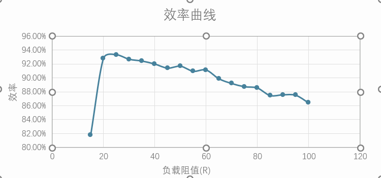
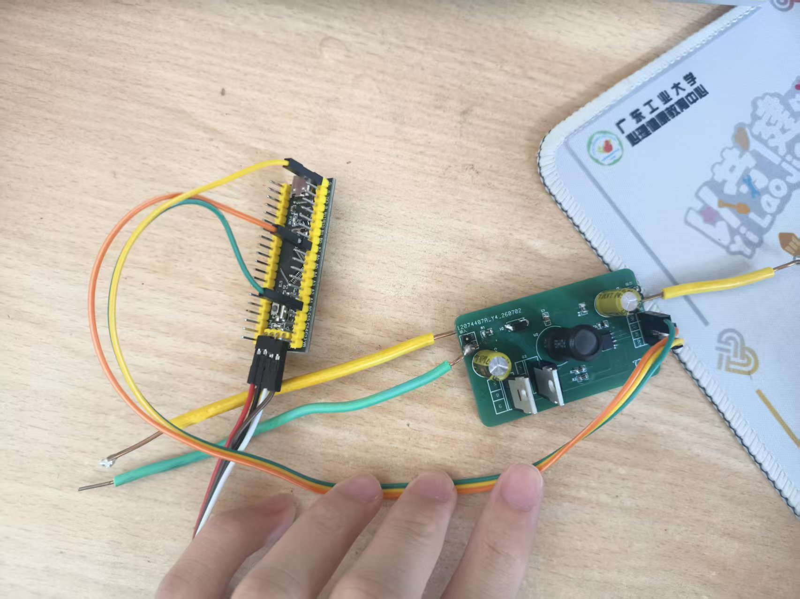
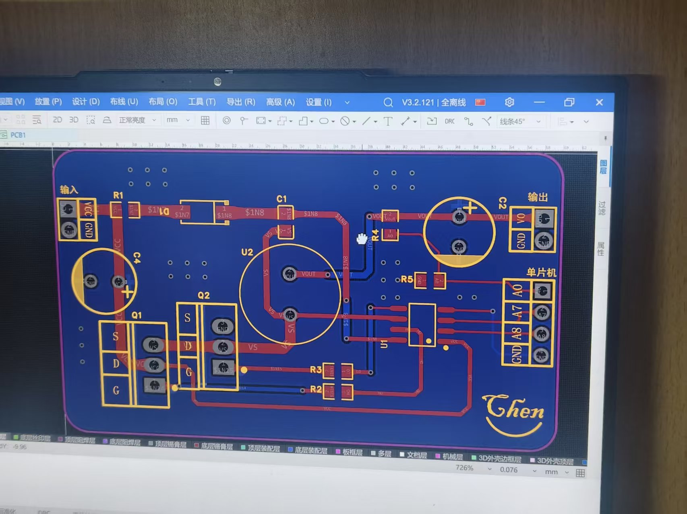
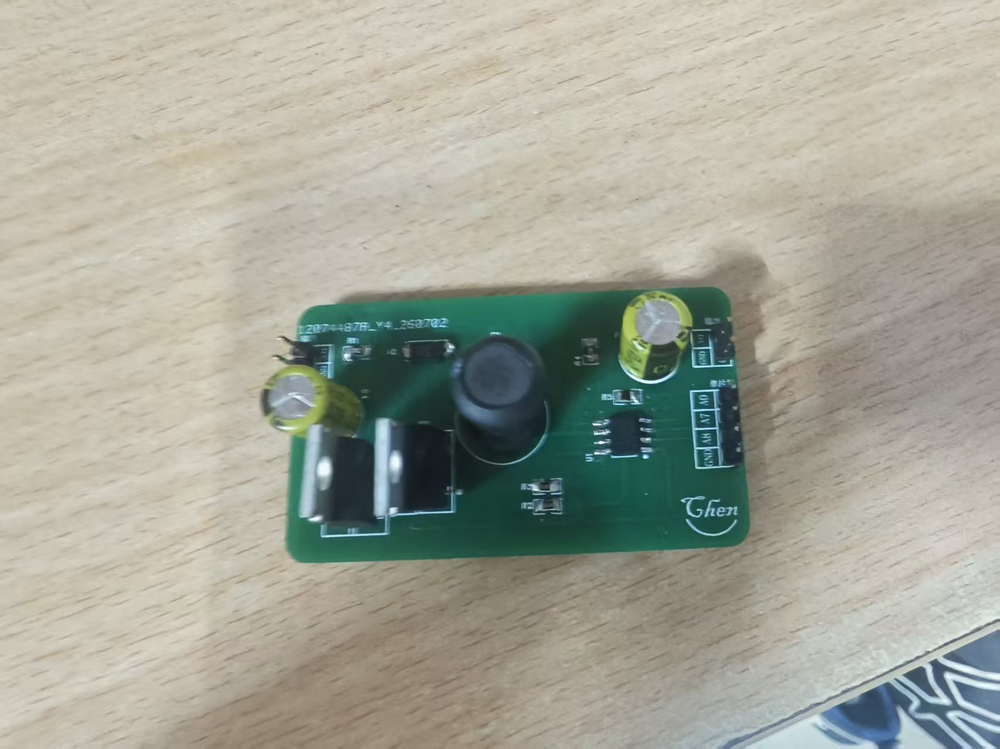
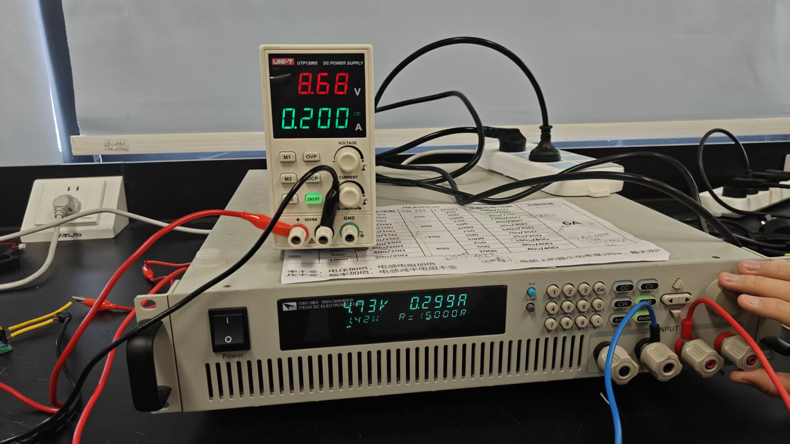

# 基于STM32的同步Buck电路设计 - 项目验收报告

## 一、 项目概述
本项目旨在设计并制作一款基于STM32微控制器的同步整流降压（Buck）转换器。利用STM32高级定时器输出互补PWM信号控制MOSFET的开关，并通过ADC采样输出电压与电流，实现数字化的电源转换与监控。

## 二、 性能测试数据与结果分析

### 1. 测试数据一览
在负载电阻从15Ω连续变化到100Ω的过程中，记录输入输出数据及转换效率如下：

| 负载阻值(Ω) | 输入电压(V) | 输入电流(A) | 输入功率(W) | 输出电压(V) | 输出电流(A) | 输出功率(W) | 效率 |
| :---: | :---: | :---: | :---: | :---: | :---: | :---: | :---: |
| 15 | 8.68 | 0.2 | 1.736 | 4.73 | 0.299 | 1.42 | 81.80% |
| 20 | 8.19 | 0.2 | 1.638 | 5.61 | 0.27 | 1.52 | 92.80% |
| 25 | 9.11 | 0.2 | 1.822 | 6.54 | 0.259 | 1.7 | 93.30% |
| 30 | 10.63 | 0.2 | 2.126 | 7.73 | 0.255 | 1.97 | 92.66% |
| 35 | 12.12 | 0.2 | 2.424 | 8.89 | 0.252 | 2.24 | 92.41% |
| 40 | 13.59 | 0.2 | 2.718 | 10.04 | 0.249 | 2.5 | 91.98% |
| 45 | 14.99 | 0.2 | 2.998 | 11.14 | 0.246 | 2.74 | 91.39% |
| 50 | 15 | 0.2 | 3 | 11.79 | 0.234 | 2.75 | 91.67% |
| 55 | 15 | 0.184 | 2.76 | 11.81 | 0.213 | 2.51 | 90.94% |
| 60 | 15 | 0.169 | 2.535 | 11.82 | 0.195 | 2.31 | 91.12% |
| 65 | 15 | 0.158 | 2.37 | 11.83 | 0.18 | 2.13 | 89.87% |
| 70 | 15 | 0.148 | 2.22 | 11.84 | 0.167 | 1.98 | 89.19% |
| 75 | 15 | 0.139 | 2.085 | 11.85 | 0.156 | 1.85 | 88.73% |
| 80 | 15 | 0.131 | 1.965 | 11.85 | 0.147 | 1.74 | 88.55% |
| 85 | 15 | 0.125 | 1.875 | 11.87 | 0.138 | 1.64 | 87.47% |
| 90 | 15 | 0.118 | 1.77 | 11.88 | 0.13 | 1.55 | 87.57% |
| 95 | 15 | 0.112 | 1.68 | 11.89 | 0.124 | 1.47 | 87.50% |
| 100 | 15 | 0.108 | 1.62 | 11.9 | 0.118 | 1.4 | 86.42% |

### 2. 效率曲线分析
根据实测数据绘制的效率曲线可以看出：
* **最高效率点**：在负载电阻为 **25Ω** 时，电路达到峰值效率 **93.30%**。
* **高效工作区间**：在负载电阻 20Ω 至 60Ω 之间，系统效率均维持在 **90% 以上**，证明电路在中轻负载下性能极佳，符合同步整流Buck电路的高效特性。
* **轻载与重载性能**：在极小负载（100Ω）时，效率仍可达86.42%，说明设计的低功耗控制策略有效；在重载（15Ω）初期，输入电压提升过程效率约为81.8%，处于可接受范围。

### 3. 效率曲线图

## 三、 项目创新点
本设计相较于传统模拟电源，充分利用了嵌入式MCU的数字化优势，主要创新点包括：

1. **数字闭环控制与MPPT潜力**：利用STM32片上ADC实时采样输出电压和电流，通过软件算法（如PID控制）动态调节PWM占空比，不仅实现了精确稳压，还具备灵活修改控制策略的优势（例如为后续基于光照强度的MPPT功能预留了接口）。
2. **死区时间软件可调**：利用STM32高级定时器的互补PWM输出功能，在代码层面精确设置了MOSFET的导通死区时间（Dead-time），有效避免了开关管直通炸机现象，提高了系统的可靠性和电磁兼容性。
3. **软启动及过流过压保护**：编写了数字化的软启动逻辑，限制上电时的浪涌电流。同时，实时监测输入输出参数，一旦发现过流或过压隐患，MCU可立即封锁PWM输出，实现了比硬件保护更智能、更灵敏的故障防护机制。

## 四、 实物展示
*(请在下方替换为你拍摄的实物照片，建议包含整体系统图及PCB局部细节图)*

> **实物照片：**
> **[图1] 嵌入式同步Buck电路系统实物图**

> 将STM32最小系统板与Buck功率电路板相连，并进行带载测试。
>
> **[图2] PCB图**

## 五、 项目总结与改进建议
该基于STM32的同步Buck电路设计在中等功率输出下表现出优异的转换效率（峰值为93.3%），各项性能指标均达到了预期的设计目标。

## 六、 数据补充

